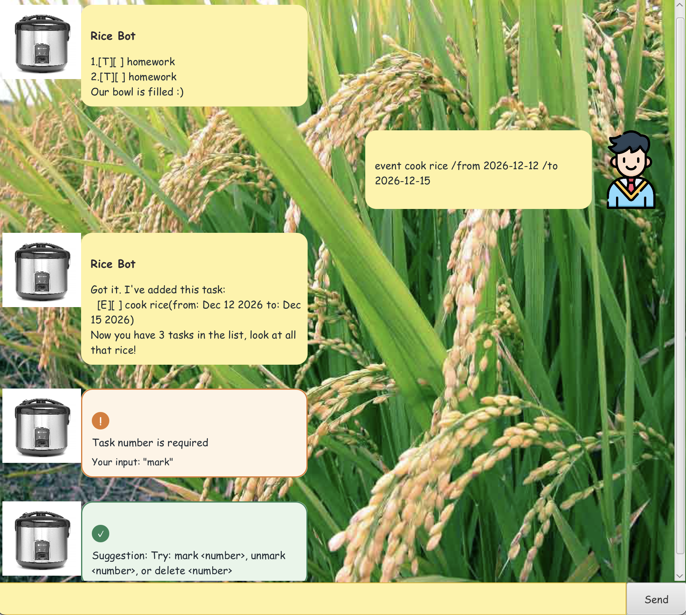

# Rice User Guide

Rice is a task-management chatbot that helps you keep track of your to-dos, deadlines, and events in one place.

## Quick start

1. Download the release v0.2
2. Open up terminal and navigate to the directory storing "ricebot.jar"
3. Run 
```
java -jar "ricebot.jar"
```
3. Type a command in the input box and press Enter.
4. View the response and continue managing your tasks.



Here are some commands you can try:

- `list` - shows all current tasks
- `todo Buy groceries` - adds a simple to-do item
- `deadline Submit report /by 2026-09-30` - adds a task with a deadline
- `event Team meeting /from 2026-09-25 /to 2026-09-25` - adds a time-based event
- `mark 1` - marks the first task as done
- `delete 2` - removes the second task
- `bye` - exits the application
- `sort` - sorts tasks by deadline

## Features

### Adding a todo: `todo`

Adds a simple task to your task list.

Format: `todo DESCRIPTION`

Example:

- `todo cook rice`

Expected outcome:

Rice adds the task and confirms the updated number of tasks in your list.

### Adding a deadline: `deadline`

Adds a task that has a due date.

Format: `deadline DESCRIPTION /by YYYY-MM-DD`

Example:

- `deadline Submit assignment /by 2026-10-01`

Expected outcome:

Rice adds the task and displays it with its deadline in the task list.

### Adding an event: `event`

Adds an event with a start and end date.

Format: `event DESCRIPTION /from YYYY-MM-DD /to YYYY-MM-DD`

Example:

- `event Career fair /from 2026-10-08 /to 2026-10-09`

Expected outcome:

Rice adds the event and shows the event details in the list.

### Listing tasks: `list`

Shows all tasks currently stored in Rice.

Format: `list`

Example:

- `list`

Expected outcome:

Rice displays every task in order, including its status and details.

### Marking tasks as done: `mark`

Marks a task as completed.

Format: `mark INDEX`

Example:

- `mark 2`

Expected outcome:

Rice marks the specified task as completed and confirms the update.

### Marking tasks as not done: `unmark`

Marks a completed task as not yet done.

Format: `unmark INDEX`

Example:

- `unmark 2`

Expected outcome:

Rice updates the task status and confirms that it is no longer complete.

### Deleting a task: `delete`

Removes a task from the list.

Format: `delete INDEX`

Example:

- `delete 3`

Expected outcome:

Rice removes the specified task and confirms the deletion.

### Finding tasks: `find`

Searches for tasks containing a keyword.

Format: `find KEYWORD`

Example:

- `find project`

Expected outcome:

Rice displays any matching tasks that contain the keyword.

### Sorting tasks: `sort`

Sorts your task list by its deadline in chronological order from earliest to latest

Format: `sort`


Rice will sorts tasks by their date when needed, ensuring tasks with deadlines appear in decreasing order of urgency

### Feature Adjustable chat window

The chat window is designed to fit the application layout comfortably, allowing you to view messages and task updates without clutter.

## Command summary

| Command | Description |
| --- | --- |
| `todo DESCRIPTION` | Adds a to-do task |
| `deadline DESCRIPTION /by YYYY-MM-DD` | Adds a task with a deadline |
| `event DESCRIPTION /from YYYY-MM-DD /to YYYY-MM-DD` | Adds an event |
| `list` | Lists all tasks |
| `mark INDEX` | Marks a task as done |
| `unmark INDEX` | Marks a task as not done |
| `delete INDEX` | Deletes a task |
| `find KEYWORD` | Finds tasks matching a keyword |
| `bye` | Exits the app |

## Notes

- Use `YYYY-MM-DD` for date inputs.
- Task numbers refer to the order shown in `list`.
- Rice saves your tasks automatically between runs.